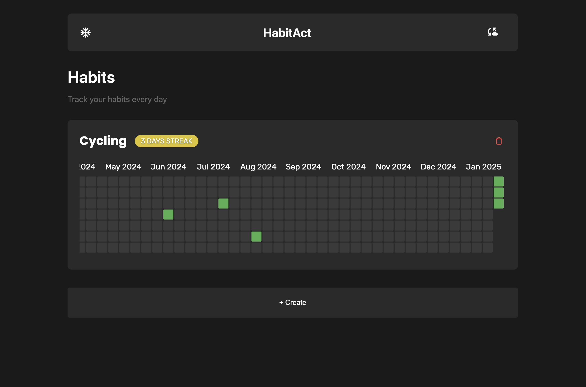

# Habit Tracker App

A modern, interactive habit tracking application built with React and TypeScript that helps users build and maintain daily habits through visual tracking and streaks.



## Features


### Core Features
- 📊 Visual year-long habit tracking grid
- 🎯 Daily habit completion tracking
- 🔥 Streak counting and tracking
- 🎉 Celebration animations with confetti on completion
- 📱 Responsive design for all devices
- 🗑️ Habit deletion capability
- 📅 Monthly progress view
- 🎨 Dynamic streak colors based on streak length

### QR Sync Feature
- 📱 Seamless device synchronization via QR code
- 🔄 Instant habit data transfer between devices
- 📷 Quick scan and connect functionality
- 🔐 Secure data transfer protocol
- 🌐 No account required for sync
- ⚡ Real-time sync status indicators

#### How QR Sync Works
1. On your primary device:
   - Click the "Generate QR Code" button
   - A unique QR code will be displayed containing your habit data

2. On your secondary device:
   - Click "Scan QR Code"
   - Allow camera access
   - Scan the QR code from your primary device
   - Habits will automatically sync between devices

3. Security Features:
   - QR codes are temporary and expire after 5 minutes
   - Data is encrypted during transfer
   - No data is stored on external servers

## Getting Started

First, run the development server:

```bash
npm run dev
# or
yarn dev
# or
pnpm dev
# or
bun dev
```

Open [http://localhost:3000](http://localhost:3000) with your browser to see the result.

You can start editing the page by modifying `app/page.tsx`. The page auto-updates as you edit the file.
